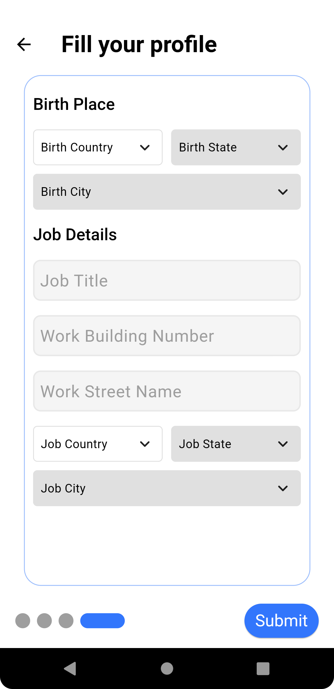

# Healthy Care App

Healthy Care is a Flutter mobile app that provides a comprehensive healthcare solution for both patients and doctors. The app features a robust authentication system, a seamless user interface, and a wide range of features to help users manage their health.

## Preview
https://github.com/Badieh/HMS_project/assets/54133250/208efab6-1a66-48ae-993d-2f8d7765da22

## Snapshots
                                    

## Technical Details
The Healthy Care App is built using Flutter and uses a Node.js backend server. The app is designed to be scalable and secure, and it uses a variety of plugins to provide a rich user experience.

## Application Features
* Bloc State Management & Getx State Management
* Designed the application to cater to two main user roles: patients and doctors
* Robust authentication system for both patients and doctors.
* Effectively integrated the app with a Node.js backend server
* Comprehensive review of patient medical history, including reports and
laboratory tests, with a built-in PDF reader for seamless viewing, downloading,
and sharing.
* Convenient upload of previous medical history using the built-in PDF scanner.
* Access to doctor diagnoses and treatments.
* User-friendly interface for browsing a list of all doctors or selecting doctors by specialization.
* Detailed doctor profiles with information on available appointments.
* Efficient booking, rescheduling, and cancellation of appointments.
* Recent medical articles section for staying up-to-date with relevant information.
* Effective notification management system.
* Dark mode feature for enhanced user experience.

## Flutter Version
Flutter 2.18.1 

## plugins used
- cupertino_icons: ^1.0.3
- flutter_svg: ^1.1.6
- flutter_screenutil: ^5.7.0
- smooth_page_indicator: ^1.0.1
- intl_phone_number_input: ^0.7.3+1
- intl: ^0.18.0
- font_awesome_flutter: ^10.4.0
- csc_picker: ^0.2.7
- country_state_city_picker: ^1.2.8
- dartz: ^0.10.1
- equatable: ^2.0.5
- animate_do: ^3.0.2
- dio: ^5.1.1
- shared_preferences: ^2.1.0
- bloc: ^8.1.1
- flutter_bloc: ^8.1.2
- conditional_builder_null_safety: ^0.0.6
- webview_flutter: ^4.0.7
- flutter_blurhash: ^0.7.0
- blurhash: ^1.0.0
- auto_size_text: ^3.0.0
- syncfusion_flutter_pdfviewer: ^21.1.39
- pdf: ^3.8.4
- printing: ^5.9.3
- path_provider: ^2.0.14
- permission_handler: ^10.2.0
- file_picker: ^5.2.10
- cunning_document_scanner: ^1.1.2
- quickalert: ^1.0.1
- readmore: ^2.2.0
- dynamic_color: ^1.6.3
- lottie: ^2.3.2
- get: ^4.6.5
- animated_icon_button: ^1.0.2
- get_storage: ^2.1.1
- http: ^0.13.6
- card_loading: ^0.3.0
